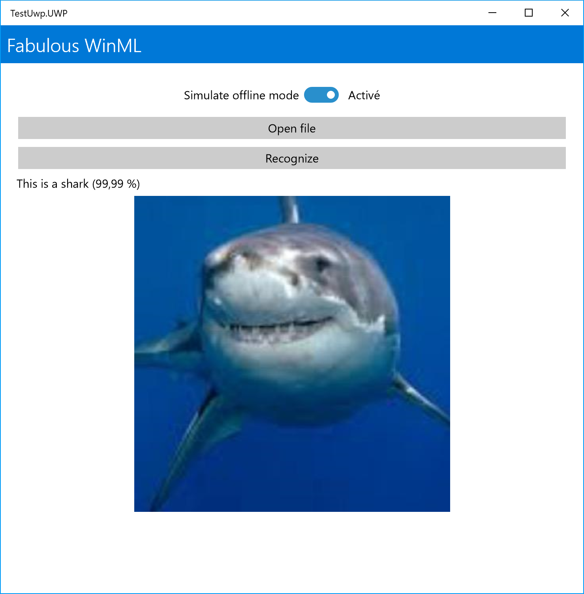
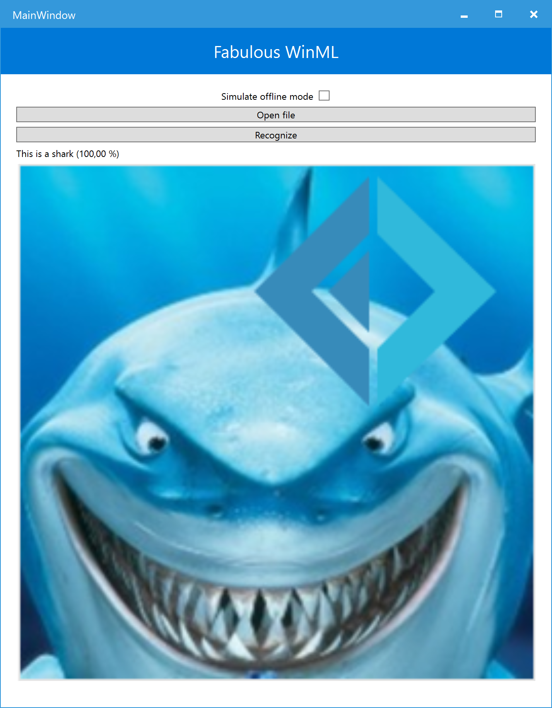
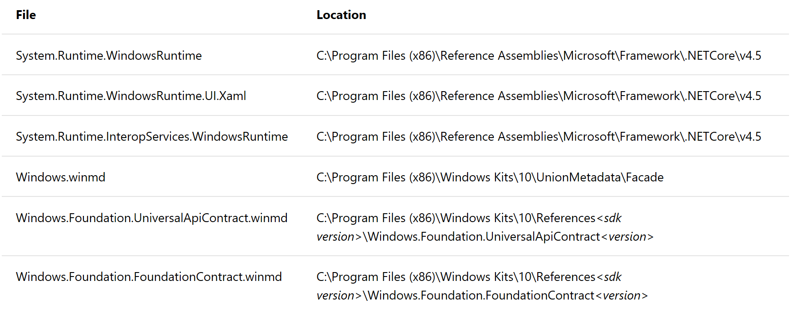

# Fabulous WinML

UWP / WPF Image recognition app written in F# and [Fabulous](https://github.com/fsprojects/Fabulous)  and C# since we can't access Universal Windows API in F#.

The purpose of this sample was to use Fabulous to build UI in F# for Windows, and showcase :
- Why F# and the Elm paradigm are great to make apps
- How easy it is to use
- How to use ONNX in Windows
- How to acess specific implementation with Xamarin Forms
- How to extend desktop app (WPF) with Universal Windows Platform

FabulousWinML can run both on UWP and Desktop WPF in Windows 10 1803 and higher!  
 

## Running the sample
If you want to build and run your own version of Fabulous WinML, you will need to get some keys for [Azure Custom Vision](https://customvision.ai/).
Follow the instructions here: 
 1. Create and train a classifer with the Custom Vision Service. You must choose a "compact" domain such as General (compact) to be able to export your classifier. If you have an existing classifier you want to export instead, convert the domain in "settings" by clicking on the gear icon at the top right. In setting, choose a "compact" model, Save, and Train your project.
 2. Export your model by going to the Performance tab. Select an iteration trained with a compact domain, an "Export" button will appear. Click on Export then ONNX (i'm using 1.0 in this sample since i built it with Windows 10 1803, but if your version of Windows 10 is higher, user ONNX version 2) then Export. Click the Download button when it appears. A *.onnx file will download.
 3. Drop your *model.onnx file into your project's Assets folder.
 4. Under Solutions Explorer/ Assets Folder add model file to project by selecting Add Existing Item.
 5. Change properties of model just added: "Build Action" -> "Content" and "Copy to Output Directory" -> "Copy if newer"

For running the WPF sample, since we are using UWP apis for access ONNX model recognition, you have to add the followinf references:

and the following: **Windows.AI.MachineLearning.Preview.MachineLearningPreviewContract** located at C:\Program Files (x86)\Windows Kits\10\References&lt;sdk_version&gt;\Windows.AI.MachineLearning.Preview.MachineLearningPreviewContract&lt;version&gt;

**note:** If you are on Windows 10 Build 17738 or higher, don't use Windows.AI.MachineLearning.Preview but Windows.AI.MachineLearning. 

For WPF, you have to run the FabulousWinML.Desktop package and not FabulousWinML.WPF directly since we can't use UWP APIs from WPF project but only with UWP Desktop Bridge. 

If you have any questions, please ask me on [Github](https://github.com/ArthurFSharp/
) or on [Twitter](https://twitter.com/arthurfsharp). 